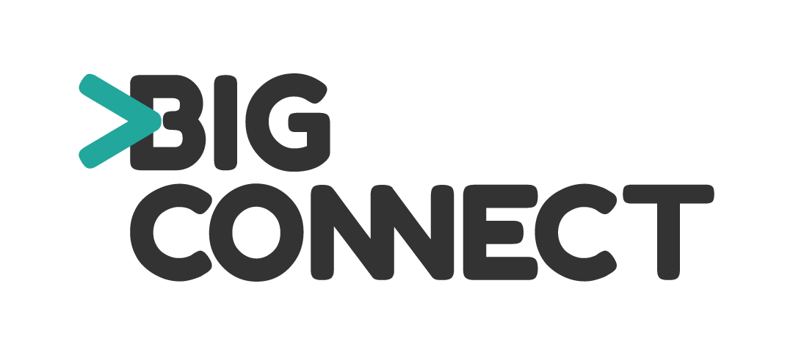

# Introduction

bigCONNECT provides an extensible platform to understand and work with any amounts of data, from any source and in any format. It’s an information-agnostic system where all data that flows into the system is transformed, mapped, enriched and then stored in a logical way using a semantic model of concepts, attributes and relationships. It provides an extensible, unified visual interface with tools for data discovery and analysis, collaboration, alerting and information management.

The platform and all its components are extensible, massively scalable and highly secure and can be used to build Big Data systems and applications that can cover most use cases and industry requirements.

It is built using the latest technologies and is currently being used by many customers in the intelligence, government, banking and academic sectors.

It is best-suited to help solve problems where there is no straightforward solution and no obvious “correct” answer.

