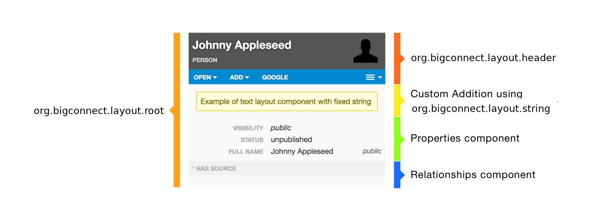

# Inspector Component

[Example code](https://github.com/mware-solutions/doc-examples/blob/master/extension-layout-component)

The Inspector is rendered using a custom layout engine consisting of a tree of layout components. This layout engine can be used elsewhere to display elements using different `contexts` also.

_Layout Components_ are nodes in the layout tree that define the type of layout and what children are included in the layout.

The `children` defined in a layout component can be references \(`ref`\) to other components, or FlightJS components specified with a `componentPath`. Layout components can also specify a flight component to be attached to the node for implementing behavior.

 


This tutorial will use layout components to override the body of all elements to include a new section above properties. Another extension will be created to modify the body of `popup` views in the graph \(open from the entity's context menu or long press on the entity to activate.\)



## Web Plugin

Register the plugin script.

```java
app.registerJavaScript("/com/mware/examples/layout_component/popupBody.js", false);
```

[LayoutComponentWebAppPlugin.java \(line 17\)](https://github.com/mware-solutions/doc-examples/blob/master/extension-layout-component/src/main/java/com/mware/examples/layout_component/LayoutComponentWebAppPlugin.java#L17)

## Register Extension

The extension will need to replace the `org.bigconnect.layout.body` layout component with a custom one. All plugins layout components have precedence over the built-in components unless the plugin component uses a less specific `applyTo`.

```javascript
bc.registry.registerExtension('org.bigconnect.layout.component', {
    identifier: 'org.bigconnect.layout.body',
    children: [
        {
            ref: 'org.bigconnect.layout.text',
            model: 'Example of text layout component with fixed string',
            className: 'examples-layout_component-subheader'
        },
        { componentPath: 'detail/properties/properties', className: 'org-bigconnect-properties', modelAttribute: 'data' },
        { componentPath: 'comments/comments', className: 'org-bigconnect-comments', modelAttribute: 'data' },
        { componentPath: 'detail/relationships/relationships', className: 'org-bigconnect-relationships', modelAttribute: 'data' },
        { componentPath: 'detail/text/text', className: 'org-bigconnect-texts' }
    ]
});
```

[plugin.js \(lines 3–16\)](https://github.com/mware-solutions/doc-examples/blob/master/extension-layout-component/src/main/resources/com/mware/examples/layout_component/plugin.js#L3-L16)

The component is identical to the one built-in to bigConnect with an additional child prepended.

```javascript
{
    identifier: 'org.bigconnect.layout.body.right',
    children: [
        { componentPath: 'comments/comments', className: 'org-bigconnect-comments', modelAttribute: 'data' },
        { componentPath: 'detail/relationships/relationships', className: 'org-bigconnect-relationships', modelAttribute: 'data' }
    ]
},
{
    identifier: 'org.bigconnect.layout.body',
```

[generic.js \(lines 64–72\)](https://github.com/mware-solutions/doc-examples/blob/master/main-source-doc/item/layoutComponents/generic.js#L64-L72)

The additional component uses a `ref` to reference a helper string component. The string component renders whatever model is passed to it as a string. The only modifications are an additional class that we use to style.

```css
.examples-layout_component-subheader {
    margin: 1em;
    padding: 0.5em;
    border-radius: 3px;
    border: 1px solid #d6d013;
    background: lightyellow;
    color: #716409;
}
```

[style.less \(lines 11–18\)](https://github.com/mware-solutions/doc-examples/blob/master/extension-layout-component/src/main/resources/com/mware/examples/layout_component/style.less#L11-L18)

## Popup Extension

The popup extension overrides the same identifier `org.bigconnect.layout.body`, except with constraints and context of the graph popup.

```javascript
bc.registry.registerExtension('org.bigconnect.layout.component', {
    applyTo: {
        constraints: ['width', 'height'],
        contexts: ['popup']
    },
    identifier: 'org.bigconnect.layout.body',
    children: [
        {
            componentPath: 'com/mware/examples/layout_component/popupBody',
            className: 'examples-layout_component-popupbody'
        }
    ]
});
```

[plugin.js \(lines 19–31\)](https://github.com/mware-solutions/doc-examples/blob/master/extension-layout-component/src/main/resources/com/mware/examples/layout_component/plugin.js#L19-L31)

This extension uses a custom `componentPath` instead of a `ref`. The component is a FlightJS component that renders how many properties are on the element and a button to search for related entities. The component triggers `positionDialog` because it renders async. This event will reposition the popup based on its size.

```javascript
this.render = function(model) {
    var self = this,
        $node = this.$node,
        count = model.properties.length;

    api.connect().then(function(c) {
        $node.text('This element has ' +
            c.formatters.string.plural(count, 'property', 'properties')
        ).append('<button class="btn btn-small">Search Related</button>')
        self.trigger('positionDialog');
    })
}
```

[popupBody.js \(lines 27–38\)](https://github.com/mware-solutions/doc-examples/blob/master/extension-layout-component/src/main/resources/com/mware/examples/layout_component/popupBody.js#L27-L38)

All popups have interaction disabled with `pointer-events: none`, so one change is needed to make the button clickable. Add a `pointer-events: all` to the button in a stylesheet.

```css
.btn {
    width: 16em;
    margin-top: 1em;
    display: block;
    pointer-events: all;
}
```

[style.less \(lines 4–9\)](https://github.com/mware-solutions/doc-examples/blob/master/extension-layout-component/src/main/resources/com/mware/examples/layout_component/style.less#L4-L9)

## String Component

`org.bigconnect.layout.text` is defined as a helper to render string models. The model passed to it is transformed to a string using `String(model)`.

You can specify a text `style`, which sets a css class with builtin text styling. Valid Style options: `title`, `subtitle`, `heading1`, `heading2`, `heading3`, `body`, `footnote`

Or set a word count to truncate the text to: `truncate: 20`, which will also add a title attribute with the full model text.

```javascript
children: [
    {
        ref: 'org.bigconnect.layout.text',
        model: 'hello world',
        style: 'title'
    }
]
```

## Collection Item

Instead of setting a fixed number of `children`, specify `collectionItem` to render a dynamic number of child elements based on the model. For each item in a model array, the collection item is duplicated as a child. This requires the model to be an array, or an error is thrown.

```javascript
registry.registerExtension('org.bigconnect.layout.component', {
    identifier: 'com.example.using.collection',
    children: [
        { ref: 'com.example.my.collection', model: ['First', 'Second'] }
    ]
});

registry.registerExtension('org.bigconnect.layout.component', {
    identifier: 'com.example.my.collection',
    // model: function(model) { /* optionally transform model */ return model; },
    collectionItem: { ref: 'org.bigconnect.layout.text' }
});
```

```markup
<!-- Output -->
<div>First</div>
<div>Second</div>
```

## Using the Layout

The layout can be used to render any single element or list of items, it's useful to specify context to allow custom rendering for that instance.

To initialize the renderer, attach the `Item` flight component to a DOM element, and pass a model object.

```javascript
require(['detail/item/item'], function(Item) {
    Item.attachTo(domElement, {
        model: model,
        // Optional Array
        constraints: ['width'],
        // Optional String
        context: 'mycontext'
    });
});
```


