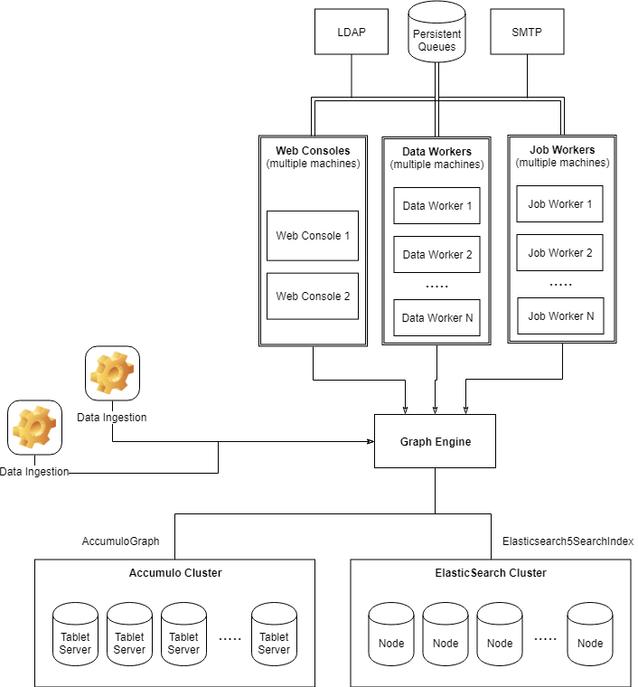

# Architecture and Concepts

Before starting to browse the source code, customize the platform or develop plugins, you should first know how BigConnect actually works. After finishing this section you should have a thorough understanding of the platform's inner-workings and its components.

## Architecture

A high level overview of a production architecture is presented below. This is an ideal deployment scenario, with dedicated machines for each Web Console, Data Workers, Job Workers, Queues and Data Ingestion.



There are three types of BigConnect nodes that can be run:

* **Data Worker** nodes usually handle data enrichment. 
* **Process Worker** nodes usually handle long running processes \(such as running Machine Learning models or Graph algorithms\) or scheduled tasks.
* **Web Console** nodes serve the Web Console application

Each BigConnect running node can be a combination of one or more types. This means that in a very simple deployment, one running node can be used to serve the Web Console, to run data worker plugins and job worker plugins, whereas in a typical production deployment you will have nodes that handle specific tasks and are also distributed across many machines.

Because nodes need to talk to each-other, each node instance can connect to a WorkQueue to publish and subscribe to messages. The current implementation offers an in-memory work queue for simple deployments and a RabbitMQ work queue for production deployments. Other types of WorkQueues can be easily implemented as well \(eg. Apache Kafka, AWS Simple Queue Service etc.\).


All three node types share a common code base that also includes additional useful services like LDAP authentication, SMTP for sending mails \(notifications\), notifications, alerts, JMX metrics, geocoding etc.


## The Graph Engine

Handles the persistence of data and provides operations for adding, updating, deleting and querying stored data. It provides a graph-like structure based on **Vertices**, **Edges** and _**multi-valued**_ **Properties** that can be applied to Vertices or Edges. 

Property Graphs have been around for a while and the technology offering has grown consistently in the last years. BigConnect however brings two new important features: **multi-valued properties** and **fine-grained security**.

It makes a clear distinction between storing data and querying data, because not all storage containers can also retrieve the data in a timely manner. This is a common architecture for Property Graphs where a search index is used to perform fast queries.

The current implementation uses Apache Accumulo for storage and ElasticSearch for searching. 


The Graph Engine itself is an abstract component and provides a Blueprints-like API, so other implementations can be added for storage and search. The code base clearly separates the interfaces that should be implemented for a new technology.


## Data Model \(Ontology\)

The core foundation of bigCONNECT is the dynamic, semantic data model, called Ontology. It represents the way you store, correlate and query all information and it’s a conceptual data model that expresses information in a factual way: objects, relations and attributes. 

Typically, the ontology is used to provide meaning to the information stored in bigCONNECT, either at ingestion time or later on, during the life-cycle of the data. It can be defined in the beginning or any time later on, to adapt to any data structure, type or meaning. Any information stored in the system can be mapped to an entity \(that has a concept\), can have some relations and some attributes. 

Concepts can be anything you can think of: person, vehicle,  bank transaction, phone call, equipment, company, location, event, network packet, log file etc. They are linked to each other using meaningful relations like “works at”, “lives in”, “has friend”, “is brother of”, “sent from IP”, “source file” etc.

Concepts and relations can also have attributes. For a company these can be the company name, formation date, address etc. For a person these can be its first name, last name, birth date, phone number, email address etc. For a “works at” relation we can have the “start date” and “end date” attributes to denote when the person started to work at a company. For a “sent from IP” relation we can have the “timestamp” and the “user” etc.

The ontology defines what Concepts, Relations and Properties are available**.** Each ontology item can also have several meta-properties such as: searchable, deletable, color etc.

### Concepts

The conceps are hierarchical and inheritable. This means that child concepts will inherit the properties of parent concepts. There is a root concept that sits at the top of the hierarchy and is called **thing** and ****It's a system-level concept that cannot be removed. Any first-level concepts must inherit the thing root concept.

Concepts also have meta-properties that describe how the concept should be treated in the system and what actions are available for them:

<table>
  <thead>
    <tr>
      <th style="text-align:left">Meta-Property</th>
      <th style="text-align:left">Description</th>
    </tr>
  </thead>
  <tbody>
    <tr>
      <td style="text-align:left">title</td>
      <td style="text-align:left">Unique identifier for the Concept</td>
    </tr>
    <tr>
      <td style="text-align:left">displayName</td>
      <td style="text-align:left">The human-readable name that should be displayed in the platform</td>
    </tr>
    <tr>
      <td style="text-align:left">icon</td>
      <td style="text-align:left">The image to use to display the entity</td>
    </tr>
    <tr>
      <td style="text-align:left">userVisible</td>
      <td style="text-align:left">If the concept is visible in the Web Console</td>
    </tr>
    <tr>
      <td style="text-align:left">searchable</td>
      <td style="text-align:left">If the concept should show in the Concept type search filter</td>
    </tr>
    <tr>
      <td style="text-align:left">deleteable</td>
      <td style="text-align:left">If the delete button should show in the Web Console</td>
    </tr>
    <tr>
      <td style="text-align:left">updateable</td>
      <td style="text-align:left">If the concept's properties can be updated</td>
    </tr>
    <tr>
      <td style="text-align:left">intents</td>
      <td style="text-align:left">See the <a href="things-you-should-know.md#intents">Intents </a>section</td>
    </tr>
    <tr>
      <td style="text-align:left">displayType</td>
      <td style="text-align:left">Specifies how the UI should display the entity<b>: </b>audio, image, video
        or document</td>
    </tr>
    <tr>
      <td style="text-align:left">color</td>
      <td style="text-align:left">The color to use on the graph and when underlining the concept in a document
        text section</td>
    </tr>
    <tr>
      <td style="text-align:left">titleFormula</td>
      <td style="text-align:left">
        <p>A JavaScript snippet used to display the title of the entity. The snipped
          could be a single expression, or multiple lines with a <code>return</code>.
          All formulas have access to:</p>
        <ul>
          <li><code>vertex</code>: The json vertex object (if the element is vertex)</li>
          <li><code>edge</code>: The json edge object (if the element is an edge)</li>
          <li><code>ontology</code>: The json ontology object (concept/relation)
            <ul>
              <li><code>id</code> The iri</li>
              <li><code>displayName</code> The display name of type</li>
              <li><code>parentConcept</code> Parent iri</li>
              <li><code>pluralDisplayName</code> The plural display name of type</li>
              <li><code>properties</code> The property iris defined on this type</li>
            </ul>
          </li>
          <li><code>prop</code>: Function that accepts a property IRI and returns the
            display value.</li>
          <li><code>props</code>: Function that accepts a property IRI and returns a
            list of all matching properties.</li>
          <li><code>propRaw</code>: Function that accepts a property IRI and returns
            the raw value.</li>
        </ul>
      </td>
    </tr>
    <tr>
      <td style="text-align:left">subtitleFormula</td>
      <td style="text-align:left">A JavaScript snippet used to display additional information in the search
        results.</td>
    </tr>
    <tr>
      <td style="text-align:left">timeFormula</td>
      <td style="text-align:left">A JavaScript snippet used to display additional information in the search
        results.</td>
    </tr>
  </tbody>
</table>Out of the box, the following concept hierarchy is provided in the [DefaultOntologyCreator](https://github.com/mware-solutions/bigconnect/blob/master/bc-common/src/main/java/com/mware/core/model/ontology/DefaultOntologyCreator.java) class.

* `Thing`
  * `Event`
  * `Person`
  * `Organization`
  * `Raw`
    * `Document`
    * `Audio`
    * `Image`
    * `Video`

### Relations

The relations are hierarchical and inheritable, like concepts. This means that child relations will inherit the properties of parent relations . There is a root relation that sits at the top of the hierarchy and is called **topObjectProperty** and ****It's a system-level relation that cannot be removed. Any first-level relations must inherit the thing root concept.

Relations also have meta-properties that describe how the they should be treated in the system and what actions are available for them:

<table>
  <thead>
    <tr>
      <th style="text-align:left">Meta-Property</th>
      <th style="text-align:left">Description</th>
    </tr>
  </thead>
  <tbody>
    <tr>
      <td style="text-align:left">title</td>
      <td style="text-align:left">Unique identifier for the relation</td>
    </tr>
    <tr>
      <td style="text-align:left">displayName</td>
      <td style="text-align:left">The human-readable name that should be displayed in the platform</td>
    </tr>
    <tr>
      <td style="text-align:left">domainConceptIris</td>
      <td style="text-align:left">The source concepts</td>
    </tr>
    <tr>
      <td style="text-align:left">rangeConceptIris</td>
      <td style="text-align:left">The destination concepts</td>
    </tr>
    <tr>
      <td style="text-align:left">inverseOfs</td>
      <td style="text-align:left">A list of relations that this relation is the inverse of</td>
    </tr>
    <tr>
      <td style="text-align:left">userVisible</td>
      <td style="text-align:left">If the relation is visible in the Web Console</td>
    </tr>
    <tr>
      <td style="text-align:left">deleteable</td>
      <td style="text-align:left">If the delete button should show in the Web Console</td>
    </tr>
    <tr>
      <td style="text-align:left">updateable</td>
      <td style="text-align:left">If the concept can be updated</td>
    </tr>
    <tr>
      <td style="text-align:left">intents</td>
      <td style="text-align:left">See the <a href="things-you-should-know.md#intents">Intents </a>section</td>
    </tr>
    <tr>
      <td style="text-align:left">color</td>
      <td style="text-align:left">The color to use on the graph</td>
    </tr>
    <tr>
      <td style="text-align:left">titleFormula</td>
      <td style="text-align:left">
        <p>A JavaScript snippet used to display the title of the entity. The snipped
          could be a single expression, or multiple lines with a <code>return</code>.
          All formulas have access to:</p>
        <ul>
          <li><code>vertex</code>: The json vertex object (if the element is vertex)</li>
          <li><code>edge</code>: The json edge object (if the element is an edge)</li>
          <li><code>ontology</code>: The json ontology object (concept/relation)
            <ul>
              <li><code>id</code> The iri</li>
              <li><code>displayName</code> The display name of type</li>
              <li><code>parentIri</code> Parent iri (if edge and is a child type)</li>
              <li><code>properties</code> The property iris defined on this type</li>
            </ul>
          </li>
          <li><code>prop</code>: Function that accepts a property IRI and returns the
            display value.</li>
          <li><code>props</code>: Function that accepts a property IRI and returns a
            list of all matching properties.</li>
          <li><code>propRaw</code>: Function that accepts a property IRI and returns
            the raw value.</li>
        </ul>
      </td>
    </tr>
    <tr>
      <td style="text-align:left">subtitleFormula</td>
      <td style="text-align:left">A JavaScript snippet used to display additional information in the search
        results.</td>
    </tr>
    <tr>
      <td style="text-align:left">timeFormula</td>
      <td style="text-align:left">A JavaScript snippet used to display additional information in the search
        results.</td>
    </tr>
  </tbody>
</table>Out of the box, the following relation hierarchy is provided in the [DefaultOntologyCreator](https://github.com/mware-solutions/bigconnect/blob/master/bc-common/src/main/java/com/mware/core/model/ontology/DefaultOntologyCreator.java) class.

**Relations**:

* Has Entity
* Has Source
* Contains image of
* Has image

### **Properties**

Properties apply to both concepts and relations. They also have meta-properties that describe how the they should be treated in the system and what actions are available for them:

<table>
  <thead>
    <tr>
      <th style="text-align:left">Meta-Property</th>
      <th style="text-align:left">Description</th>
    </tr>
  </thead>
  <tbody>
    <tr>
      <td style="text-align:left">title</td>
      <td style="text-align:left">Unique identifier for the property</td>
    </tr>
    <tr>
      <td style="text-align:left">displayName</td>
      <td style="text-align:left">The human-readable name that should be displayed in the platform</td>
    </tr>
    <tr>
      <td style="text-align:left">dataType</td>
      <td style="text-align:left">The type of the property: string, integer, double, currency, date, boolean,
        geoLocation. The property is rendered in the Web Console based on its type.</td>
    </tr>
    <tr>
      <td style="text-align:left">userVisible</td>
      <td style="text-align:left">If the property is visible in the Web Console</td>
    </tr>
    <tr>
      <td style="text-align:left">searchable</td>
      <td style="text-align:left">If the property should show in the <em>Filter by Property</em> list in the
        Web Console</td>
    </tr>
    <tr>
      <td style="text-align:left">searchFacet</td>
      <td style="text-align:left">If the property should be displayed as a Search Facet on the Web Console</td>
    </tr>
    <tr>
      <td style="text-align:left">textIndexHints</td>
      <td style="text-align:left">
        <p>Specifies how text is indexed in the full text search:
          <br />
        </p>
        <ul>
          <li>NONE - Do not index this property (default)</li>
          <li>ALL - Combination of FULL_TEXT and EXACT_MATCH</li>
          <li>FULL_TEXT - Allow full text searching. Good for large text</li>
          <li>EXACT_MATCH - Allow exact matching. Good for multi-word known values.</li>
        </ul>
      </td>
    </tr>
    <tr>
      <td style="text-align:left">deleteable</td>
      <td style="text-align:left">Should the delete button show in the Web Console and allow deleting properties
        in REST calls.</td>
    </tr>
    <tr>
      <td style="text-align:left">addable</td>
      <td style="text-align:left">Should the add property list show this property and allow creating property
        values in REST calls.</td>
    </tr>
    <tr>
      <td style="text-align:left">updateable</td>
      <td style="text-align:left">Should the edit button show in the UI and allow updating property values
        in REST calls.</td>
    </tr>
    <tr>
      <td style="text-align:left">intents</td>
      <td style="text-align:left">See the <a href="things-you-should-know.md#intents">Intents </a>section</td>
    </tr>
    <tr>
      <td style="text-align:left">displayType</td>
      <td style="text-align:left">
        <p>Specifies how the UI should display the value. Plugins can add new display
          types, see the <em>Ontology Property Display Types</em> section in Font-end
          Plugins</p>
        <p></p>
        <ul>
          <li><code>bytes</code>: Show the value in a human readable size unit based
            on size. Assumes the value is in bytes.</li>
          <li><code>dateOnly</code>: Remove the time from the property value and stop
            timezone shifting display for users (Date will be same regardless of users
            timezone).</li>
          <li><code>geoLocation</code>: Show the geolocation using description (if available),
            and truncated coordinates.</li>
          <li><code>heading</code>: Show a direction arrow, assumes the value is number
            in degrees.</li>
          <li><code>link</code>: Show the value as a link (assumes the value is valid
            href)</li>
          <li><code>longtext</code>: Show the value using multiline whitespace, and
            allow editing in a instead of one line</li>
        </ul>
      </td>
    </tr>
    <tr>
      <td style="text-align:left">propertyGroup</td>
      <td style="text-align:left">Allows multiple properties to be included under a unified collapsible
        header in the Inspector. All properties that match the value (case-sensitive)
        will be placed in a section.</td>
    </tr>
    <tr>
      <td style="text-align:left">possibleValues</td>
      <td style="text-align:left">
        <p>Creates a pick list on the Web Console. The value is a JSON document describing
          the possible values. In this example, <code>F</code> will be the raw value
          saved in the property value, but <code>Female</code> would be displayed to
          user in pick list and in the Inspector:</p>
        <p><code>{ &quot;M&quot;: &quot;Male&quot;, &quot;F&quot;: &quot;Female&quot; }</code>
        </p>
      </td>
    </tr>
    <tr>
      <td style="text-align:left">displayFormula</td>
      <td style="text-align:left">
        <p>A JavaScript snippet used to display the value of the property. The snipped
          could be a single expression, or multiple lines with a <code>return</code>.
          All formulas have access to:</p>
        <ul>
          <li><code>vertex</code>: The json vertex object (if the element is vertex)</li>
          <li><code>edge</code>: The json edge object (if the element is an edge)</li>
          <li><code>ontology</code>: The json ontology object</li>
          <li><code>prop</code>: Function that accepts a property IRI and returns the
            display value.</li>
          <li><code>props</code>: Function that accepts a property IRI and returns a
            list of all matching properties.</li>
          <li><code>propRaw</code>: Function that accepts a property IRI and returns
            the raw value.</li>
        </ul>
      </td>
    </tr>
    <tr>
      <td style="text-align:left">validationFormula</td>
      <td style="text-align:left">A JavaScript snippet used to validate the value of the property. The snipped
        could be a single expression, or multiple lines with a <code>return true/false</code>
      </td>
    </tr>
    <tr>
      <td style="text-align:left">aggType</td>
      <td style="text-align:left">How the property should be aggregated in ElasticSearch: none, Histogram,
        GeoHash , Statistics, Calendar</td>
    </tr>
    <tr>
      <td style="text-align:left">aggInterval</td>
      <td style="text-align:left">
        <p>The aggregation interval for Histogram aggregation:</p>
        <ul>
          <li>For date fields: year, quarter, month, week, day, hour, minute, second</li>
          <li>For numeric fields: a positive decimal</li>
        </ul>
      </td>
    </tr>
    <tr>
      <td style="text-align:left">aggCalendarField</td>
      <td style="text-align:left">For Calendar aggregation: DAY_OF_MONTH, DAY_OF_WEEK, HOUR_OF_DAY, MONTH,
        YEAR</td>
    </tr>
    <tr>
      <td style="text-align:left">aggTimeZone</td>
      <td style="text-align:left">The timezone to use in the Calendar aggregation</td>
    </tr>
    <tr>
      <td style="text-align:left">aggPrecision</td>
      <td style="text-align:left">The GeoHash precision to use for the GeoHash aggregation</td>
    </tr>
  </tbody>
</table>Out of the box, the following properties are provided in the [DefaultOntologyCreator](https://github.com/mware-solutions/bigconnect/blob/master/bc-common/src/main/java/com/mware/core/model/ontology/DefaultOntologyCreator.java) class.

* Title - the title of the object
* Text - any text contents
* Source - the origin
* ...

### Intents

The ontology defines concepts, relationships, and properties. During data processing, BigConnect needs to know what type of concept, relationship, and property to assign when it finds them. For example if BigConnect is scanning a document and finds a phone number, BigConnect will need to assign a concept to that phone number. This is where intents come in.

Intents can be defined in the ontology and overridden in the configuration. Out of the box, the following intents are provided, and they are used in the provided Data Workers. See the [OntologyConstants ](https://github.com/mware-solutions/bigconnect/blob/master/bc-common/src/main/java/com/mware/core/model/ontology/OntologyConstants.java)file to find their usage.

* entityImage
* artifactContainsImage
* artifactTitle
* artifactHasEntity
* artifactContainsImageOfEntity
* entityHasImage
* media.duration
* media.dateTaken
* media.deviceMake
* media.deviceModel
* media.width
* media.height
* media.metadata
* media.fileSize
* media.description
* media.imageHeading
* media.yAxisFlipped
* media.clockwiseRotation
* bankAccount
* phoneNumber
* pageCount
* documentAuthor
* audioDuration
* videoDuration
* geoLocation


There are a lot of system properties, concepts and relations used internally by BigConnect.


The initial ontology is defined in the [DefaultOntologyCreator](https://github.com/mware-solutions/bigconnect/blob/master/bc-common/src/main/java/com/mware/core/model/ontology/DefaultOntologyCreator.java) class.

## Configuration

There are many strategies for locating BigConnect's configuration properties. By default, BigConnect will use [`com.mware.core.config.FileConfigurationLoader`](https://github.com/mware-solutions/bigconnect/blob/master/bc-common/src/main/java/com/mware/core/config/FileConfigurationLoader.java) to load configuration files and [`com.mware.core.bootstrap.lib.LibDirectoryLoader`](https://github.com/mware-solutions/bigconnect/blob/master/bc-common/src/main/java/com/mware/core/bootstrap/lib/LibDirectoryLoader.java) to load additional `.jar` files.

The following directories will be searched in order:

* /opt/bigconnect for Linux/OSX
* c:/opt/bigconnect for Windows
* ${appdata}/Bigconnect
* ${user.home}/.bigconnect
* a directory specified with the `BIGCONNECT_DIR` environment variable

The FileConfigurationLoader will load alphabetically all files in `config` sub-directories with `.properties` extensions, allowing you to override properties in various places.

All `.jar` files in `/lib` sub-directories will be added to the classpath. 


There is also a [`com.mware.core.bootstrap.lib.HdfsLibLoader`](https://github.com/mware-solutions/bigconnect/blob/master/bc-common/src/main/java/com/mware/core/bootstrap/lib/LibDirectoryLoader.java)that can be used to load .jar files from HDFS. This is useful when running Data Workers or Process Workers as Hadoop jobs.


For the purposes of this guide, `$BIGCONNECT_DIR` will refer to the parent directory of sub-directories where your config and lib files are stored, regardless of which of the above options you choose to use

## Security

An important feature of the Graph Engine is that it includes a layer of fine-grained data security: every operation on the data structure is made using a set of Authorizations and each piece of data has a Visibility label attached to it. 

The Visibility is used to determine whether a given user meets the security requirements to read the value.  This enables data of various security levels to be stored in the same element \(vertex or edge\) and users of varying degrees of access to query the data, while preserving data confidentiality.

When changes to the graph are made, users can specify a visibility label for each value. These labels consist of a set of user-defined tokens that are required to read the value the label is associated with.  The set of tokens required can be specified using syntax that supports logical AND `&` and OR `|` combinations of terms, as well as nesting groups `()` of terms together.

Each term is comprised of one to many alpha-numeric characters, hyphens, underscores or periods. Optionally, each term may be wrapped in quotation marks which removes the restriction on valid characters. In quoted terms, quotation marks and backslash characters can be used as characters in the term by escaping them with a backslash.

For example, suppose within our organization we want to label our data values with security labels defined in terms of user roles. We might have tokens such as:

```text
admin
audit
system
```

These can be specified alone or combined using logical operators:

```text
// Users must have admin privileges
admin

// Users must have admin and audit privileges
admin&audit

// Users with either admin or audit privileges
admin|audit

// Users must have audit and one or both of admin or system
(admin|system)&audit
```

When both `|` and `&` operators are used, parentheses must be used to specify precedence of the operators.

When clients attempt to read data from BigConnect,  any security labels present are examined against the set of authorizations passed by the client code.  If the authorizations are determined to be insufficient to satisfy the visibility label, the value is suppressed from the set of results sent back to the client.

Authorizations are specified as a comma-separated list of tokens the user possesses:

```text
Authorization auths = new Authorizations("admin","system");
```

## 

